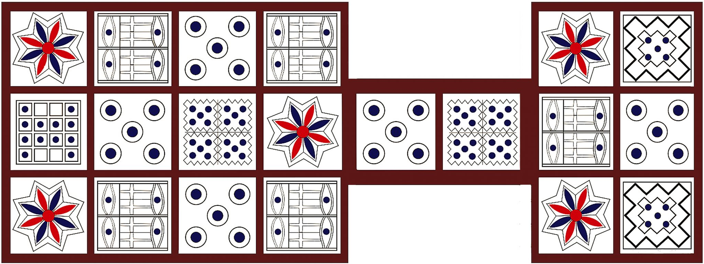

# Royal Game of Ur

One of the oldest game boards in the world.

[Basic rules](https://en.wikipedia.org/wiki/Royal_Game_of_Ur#Basic_rules).

(Source: [Wikipedia - Royal Game of Ur](https://en.wikipedia.org/wiki/Royal_Game_of_Ur))

## Printable board

(Source: [GD Keys - The Design of the Royal Game of Ur](https://gdkeys.com/the-design-of-the-royal-game-of-ur/))
