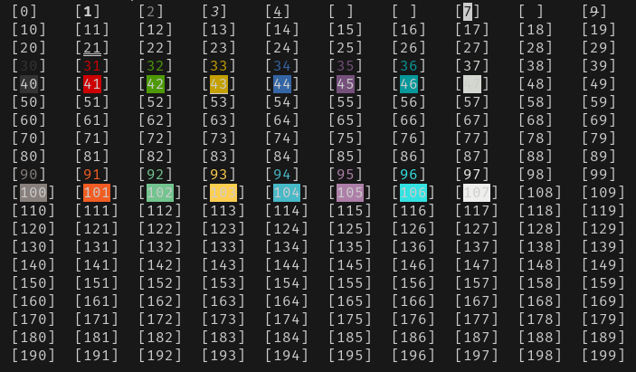

# Bash

## Colours

To print ANSI colour code in bash:
```
echo -e "\e[32mThis will be green\e[0m"
```

Important to remember `-e` on echo, and ANSI code 0 to "stop the colour".

Show ANSI colours from 1 to 200:
```
(
  for i in 0 100; do
    for j in 0 10 20 30 40 50 60 70 80 90; do
      for k in 0 1 2 3 4 5 6 7 8 9; do
        n=$((i + j + k))
        echo -e -n ";[\e[${n}m${n}\e[0m]"
      done
      echo
    done
  done
) | column -s \; -t
```



## set -ex

[https://www.peterbe.com/plog/set-ex](https://www.peterbe.com/plog/set-ex)

## variable indirection

Value of variable in with name of variable in another variable ;-)

```
export TEST=42
export NAME=TEST

echo ${NAME} # outputs "TEST"
echo ${!NAME} # outputs "42"
```

Variable containing mixed text and env variables:
```
export TEST='/home/${USER}/some-dir'

$ echo ${TEST} # outputs: /home/${USER}/some-dir

$ echo ${TEST} | envsubst # outputs: /home/username/some-dir

$ echo ${TEST} | sudo envsubst # outputs: /home/root/some-dir

$ echo ${TEST} | su - some-other-user envsubst -c envsubst # outputs: /home/some-other-user/some-dir
```

## test if variable is set

From: [https://stackoverflow.com/a/39296572](https://stackoverflow.com/a/39296572)

```
$ unset DEPLOY_ENV
$ echo "'${DEPLOY_ENV:-default_value}' '${DEPLOY_ENV-default_value}'"
'default_value' 'default_value'
$ DEPLOY_ENV=
$ echo "'${DEPLOY_ENV:-default_value}' '${DEPLOY_ENV-default_value}'"
'default_value' ''
```

## Other fun variable expansions:

If parameter is unset or null, the expansion of word is substituted. Otherwise, the value of parameter is substituted.
```
${parameter:-word}
```

If parameter is unset or null, the expansion of word is assigned to parameter.
The value of parameter is then substituted. Positional parameters and special parameters may not be assigned to in this way.
```
${parameter:=word}
```

If parameter is null or unset, the expansion of word (or a message to that effect if word is not present) is written to the standard error and the shell, if it is not interactive, exits. Otherwise, the value of parameter is substituted.
```
${parameter:?word}
```

If parameter is null or unset, nothing is substituted, otherwise the expansion of word is substituted.
```
${parameter:+word}
```

It expands to up to length characters of the value of parameter starting at the character specified by offset.
If offset evaluates to a number less than zero, the value is used as an offset in characters from the end of the value of parameter.
If length evaluates to a number less than zero, it is interpreted as an offset in characters from the end of the value of parameter rather than a number of characters.
```
${parameter:offset}
${parameter:offset:length}
```
Examples with normal variable (careful with - "dash" before negative numbers):
```
string=01234567890abcdefgh
echo ${string:7} # outputs: 7890abcdefgh
echo ${string:7:0} # outputs nothing
echo ${string:7:2} # outputs: 78
echo ${string:7:-2} # outputs: 7890abcdef
echo ${string: -7} # outputs: bcdefgh
echo ${string: -7:0} # outputs nothing
echo ${string: -7:2} # outputs: bc
echo ${string: -7:-2} # outputs: bcdef
```
Examples with arrays (even works with the @ array):
```
array=(0 1 2 3 4 5 6 7 8 9 0 a b c d e f g h)
echo ${array[@]:7} # outputs: 7 8 9 0 a b c d e f g h
echo ${array[@]:7:2} # outputs: 7 8
echo ${array[@]: -7:2} # outputs: b c
echo ${array[@]: -7:-2} # outputs: bash: -2: substring expression < 0
echo ${array[@]:0} # outputs: 0 1 2 3 4 5 6 7 8 9 0 a b c d e f g h
echo ${array[@]:0:2} # outputs: 0 1
echo ${array[@]: -7:0} # outputs nothing
```

[Index expansion parameter](https://www.gnu.org/savannah-checkouts/gnu/bash/manual/bash.html#index-expansion_002c-parameter)

## Arrays as arguments for functions

```
#!/bin/bash

ARRAY_A=()
ARRAY_B=()

for i in 0 1 2; do
	for j in 0 1 2; do
		ARRAY_A+=("Some line ${i} at ${j}")
		ARRAY_B+=("Some completely different line ${j} at ${i}")
	done
done

function output_array() {
	local name="$1"; shift
	local array=("$@")
	echo "Name: ${name}"
	for index in ${!array[@]}; do
		echo "${index}: ${array[index]}"
	done
}

output_array "ARRAY_A" "${ARRAY_A[@]}"

output_array "ARRAY_B" "${ARRAY_B[@]}"
```

## How to read one line at a time from output of a command?

Using [Process Substitution](https://www.gnu.org/software/bash/manual/html_node/Process-Substitution.html):
```
while read -r line
do
	... do something with ${line} ...
done < <(echo "${all_the_lines}")
```

Using [command substitution](https://www.gnu.org/software/bash/manual/html_node/Command-Substitution.html) (and [here-string](https://www.gnu.org/software/bash/manual/html_node/Redirections.html#Here-Strings)):
```
while read -r line
do
	... do something with ${line} ...
done <<<$(echo "${all_the_lines}")
```

Using [here-string](https://www.gnu.org/software/bash/manual/html_node/Redirections.html#Here-Strings):
```
while read -r line
do
	... do something with ${line} ...
done <<<${all_the_lines}
```

[Source article](https://unix.stackexchange.com/questions/52026/bash-how-to-read-one-line-at-a-time-from-output-of-a-command)

# CD on steroids

[How to navigate directories faster with bash](https://mhoffman.github.io/2015/05/21/how-to-navigate-directories-with-the-shell.html)

