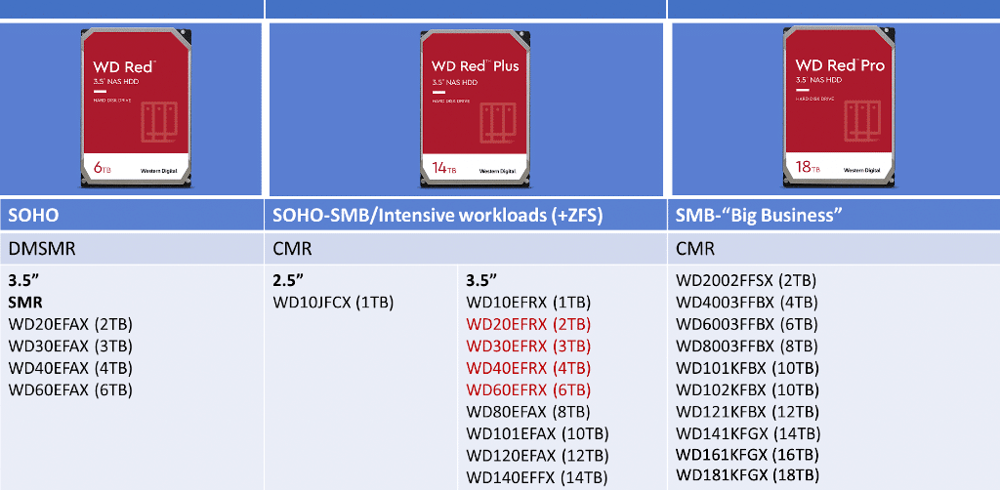

# HDD's

## WD Red drives

[On WD Red NAS Drives](https://blog.westerndigital.com/wd-red-nas-drives/)

[Western Digital’s dreaded SMR Red drive](https://arstechnica.com/gadgets/2020/06/western-digitals-smr-disks-arent-great-but-theyre-not-garbage/)

## SMR

[Device-Managed Shingled Magnetic Recording (DMSMR)](https://blog.westerndigital.com/dmsmr-device-managed-shingled-magnetic-recording/)

[Complete list of SMR drives as of 11/26/23](https://www.reddit.com/r/DataHoarder/comments/184vwtd/complete_list_of_smr_drives_as_of_112623/)

Important note: There are three types of SMR drives, DM-SMR, HM-SMR and HA-SMR.

- DM-SMR (Drive Managed-SMR) is the most common and are what 99.9% of drives that home consumers will buy. All write/read activities are handled by the drives electronics.
- HM-SMR (Host Managed-SMR) write/read activities are as the name stated, handled by specialized off drive hardware and software. This what is used in the current 26TB WD Ultrastar, upcoming 28TB WD drive and likely the upcoming 30TB Seagate drive.
- HA-SMR (Host Aware-SMR) - I don't fully understand how HA-SMR drives work, but they're not as efficient at handling writes HM-SMR and are likely to be widely implemented/available.
