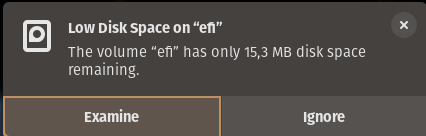

# Pop!\_OS

Best ubuntu based distro ever... [Pop!_OS by System76](https://pop.system76.com/)

## Change boot loader settings

Located in:
```
/boot/efi/loader/loader.conf
```

To get the boot menu to always display for two seconds during boot add the line:
```
timeout 2
```

[loader.conf man page](https://www.freedesktop.org/software/systemd/man/latest/loader.conf.html)

## Boot partition running out of space



[Boot partition runs out of space within months](https://github.com/pop-os/pop/issues/1714#issuecomment-1481212935)

It helps to change the initramfs compression method from `zstd` to `xz`.
```
sudo vi /etc/initramfs-tools/initramfs.conf
```
Change `COMPRESS=zstd` to `COMPRESS=xz`.

Then regenerate initramfs with this command:
```
sudo update-initramfs -c -k all
```

## Rescue your install

1. Boot into a recovery system (either on disk or make a USB stick)
2. Launch a terminal
3. Make sure your disk layout matches the commands below (run: `lsblk`)
4. Open luks:
```
sudo cryptsetup luksOpen /dev/nvme0n1p3 cryptdata
```
5. Check the names of the mapped luks partition:
```
ls -la /dev/mapper
```
6. Mount the root partition:
```
sudo mount /dev/mapper/data-root /mnt
```
7. Mount the EFI partition:
```
sudo mount /dev/nvme0n1p1 /mnt/boot/efi
```
8. Move stuff into `/mnt`:
```
for i in /dev /dev/pts /proc /sys /run; do sudo mount -B $i /mnt$i; done
```
9. Don't know why...
```
sudo cp -n /etc/resolv.conf /mnt/etc/
```
10. Chroot into the mounted system:
```
sudo chroot /mnt
```

Go nuts! Install software... Fix shit...

When ready to try the fixes:
```
exit
sudo reboot
```