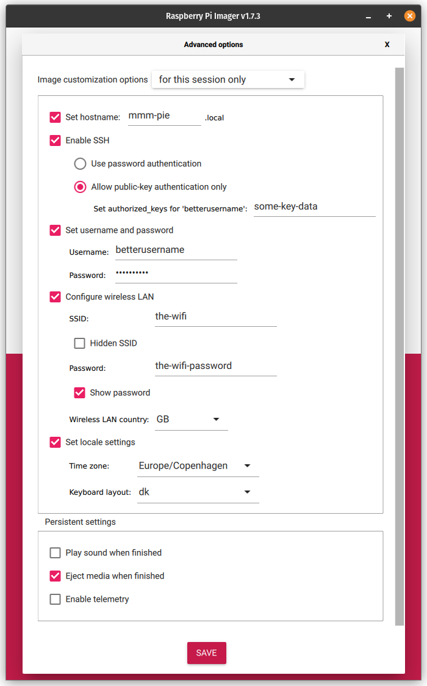

# Mmm Pie

## Install

From [this article](https://www.tomshardware.com/reviews/raspberry-pi-headless-setup-how-to,6028.html).

Write the SD card with [Raspberry Pi Imager](https://www.raspberrypi.com/software/) then:
1. Choose OS
1. Choose storage (the SD card)
1. But before clickiong "Write", click settings (cogwheel lower right corner)
   1. Set hostname (can be done later, but convenient)
   1. Enable SSH, preferably with public-key authentication
   1. Set username and password, and choose something other than `pi` for the username ;-)
   1. Configure wireless LAN if needed
   1. Set locale (can also be done later)
1. Click "Save"
1. Click "Write"



## Protect your Pi

[17 Security Tips To Protect Your Raspberry Pi Like A Pro](https://raspberrytips.com/security-tips-raspberry-pi/)

## Network

Want to change network settings and/or set a static IP address... well Raspberry Pi is a mess. (Said the old fart used to Debian).

Used to be set through `/etc/dhcpcd.conf` but now it seems to have changed to `NetworkManager`.

Try `nmcli` or `nmtui`.

## Disable Wifi and Bluetooth

Add to `/boot/firmware/config.txt`:
```
[all]
dtoverlay=disable-wifi,disable-bt
```
Courtesy of [Nils Marving](https://github.com/marvingnils)

## Pi bugs you about setting up 'a valid user'

Sometimes when setting up Rasbian as detailed above, and configuring `username` and `password` before first boot, it ends up displaying this message on each and every login:
```
Please note that SSH may not work until a valid user has been set up.

See http://rptl.io/newuser for details.
```

This is driven by a file located in `/etc/ssh/sshd_config.d` called `rename_user.conf`.

Remove that file, and the message dissapears.

## Change default username after install

I always go for the quick and dirty, but here is [the article](https://raspberrytips.com/change-raspberry-pi-username/).

Change to root:
```
sudo -i
```

Rename `pi` to your username of choice:
```
sed -i s/pi/<new_user>/g /etc/passwd
sed -i s/pi/<new_user>/g /etc/shadow
sed -i s/pi/<new_user>/g /etc/group
sed -i s/pi/<new_user>/g /etc/sudoers
sed -i s/pi/<new_user>/g /etc/gshadow
mv /home/pi /home/<new_user>
reboot
```

**WARNING** this enables the password when using `sudo` so if you haven't changed the password before doing this, you will be locked out of your Pi.